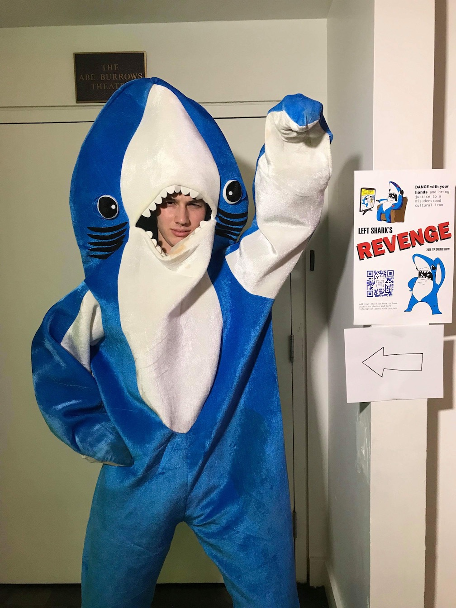
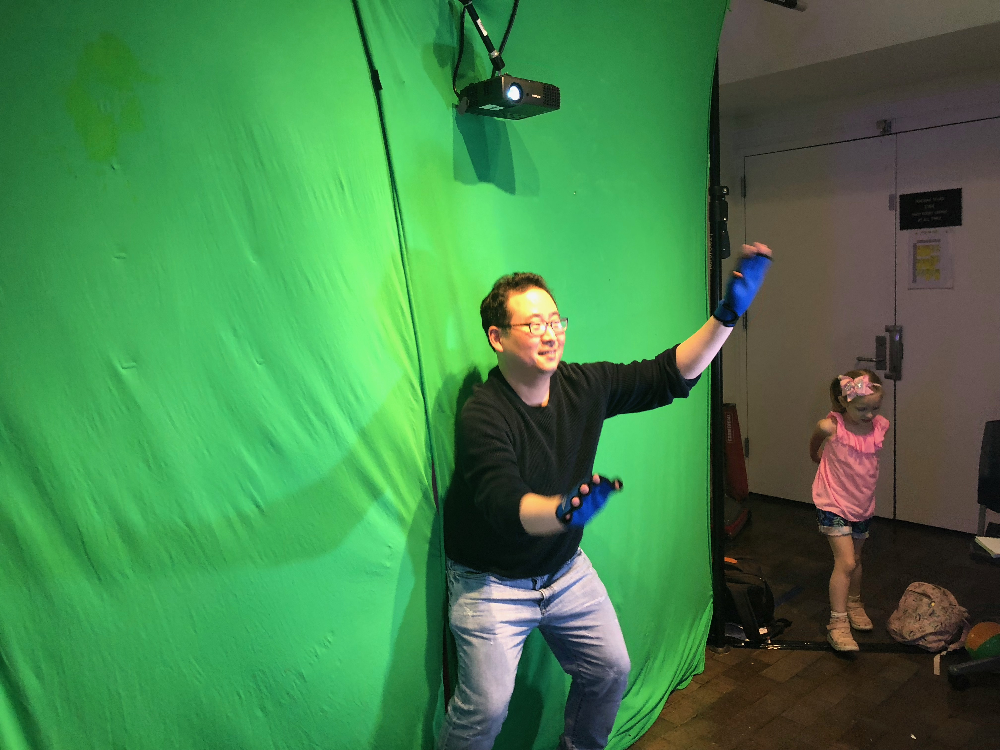
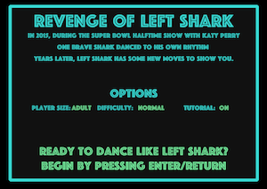
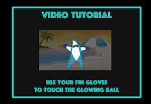
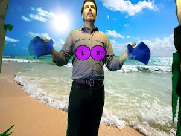
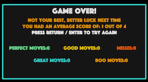

# [Revenge of Left Shark](http://www.blog.calebfergie.com/2018/05/02/revenge-of-left-shark/) - DDR with your hands

Revenge of Left Shark is an interactive rhythm and dance game. In other words, DDR with your hands. The game uses computer vision to place the player on the beach, supply visual cues and provide real-time scoring information.

This project was created in Spring 2018, and demo'd live at the [2018 ITP Spring Show](https://itp.nyu.edu/shows/spring2018/) with a full green screen and projector setup.

# Notes about this repository

If you really do download and try to use this program, don't hesitate to [reach out](mailto:ccf264@nyu.edu) with issues or questions. Or just raise an issue here on GitHub!

More details about this game can also be found [here](http://www.blog.calebfergie.com/2018/05/02/revenge-of-left-shark/).

### Game sections

The game is broken into four sections, which can be **cycled through at any time by pressing the ENTER key**:

#### 1. Introduction

The opening screen with game options and introductory text.

#### 2. Tutorial

An 18-second tutorial video that will run and automatically advance to the next section when complete.

#### 3. Game

The actual game, which lasts about 1 minute and 30 seconds, and automatically advances to the next section when complete.

#### 4. Results

The stats from the most recent game played, which will display until a user presses ENTER, which resets the game.

### Developer interface and controls

The developer interface can be revealed at any time by **pressing the "o" key**. The interface reveals boxes of computer vision that are looking for "fins" of a blue color. The inteface also lists a series threshold variable values that can be maniuplated to control for enviromental lights and colors.

These controls include:
* **Distance Threshold:** The *minimum* number of pixels between two distinct "fins". Use the 'a' and 's' keys to increase and decrease this value, respectively. *Increase this number if too many boxes are appearing.*
* **Color Threshold:** The *maximum* distance (in terms of three values Red, Green ,and Blue) that counts as a "blue" pixel. Use the 'z' and 'x' keys to increase and decrease this value, respectively. *Decrease this number if no boxes are appearing.*
* **Green Screen Threshold:** The *maximum* distance (in terms of three values Red, Green ,and Blue) that counts as a "green" pixel, which will be replaced with a beach image pixel. Use the 'q' and '' keys to increase and decrease this value, respectively. *Decrease this number if your background is not changing into the beach scene.* Also see 'Chromakey modification' below.
* **Framerate:** A readout of the current framerate. A framerate of 15 or more is recommended. Note that using the developer interface *further reduces* the framerate.

### Chromakey controls

**You don't need a green screen to play this game! Nor do you need blue fins.**

To change the background color that will be turned into a beach screen, just search for "hardcoded GREEN" comments in the .pde file, and replace the second set of R, G, and B values (currently set to 0, 255, 0) with the color of your background. Note that there are **3 places** this value needs to be replaced.

To change the fin color the program is searching for, search for "harcoded fin color" comments in the .pde file, and do the same replacement with the colors of the "fins" you want to use. This only needs to be done in one place.

### Final notes

The game takes a screenshot of the enviroment at 4 times during the game, as defined by the *'photoOp'* variables. You can change these values, and **also take a screenshot at any time by pressing the 'p' key**.
